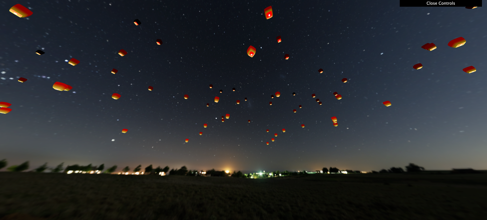

## 
 shader着色器打造漫天飞舞孔明灯

[色彩空间](./色彩空间.md)
[glsl内置变量](./glsl内置变量.md)
[HDR](./HDR.md)

[高级GLSL](https://learnopengl-cn.readthedocs.io/zh/latest/04%20Advanced%20OpenGL/08%20Advanced%20GLSL/)
[轨道控制器](https://threejs.org/docs/?q=OrbitControls#examples/zh/controls/OrbitControls)

 
 
 
