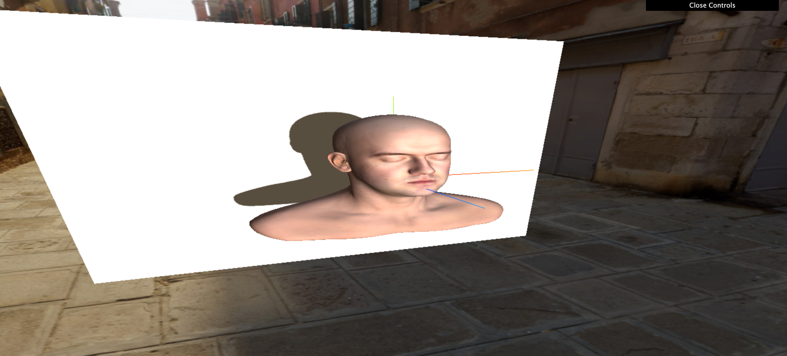

## 使用着色器加工材质

[材质(Material)](https://threejs.org/docs/?q=Mater#api/zh/materials/Material)

.onBeforeCompile ( shader : Shader, renderer : WebGLRenderer ) : undefined
在编译shader程序之前立即执行的可选回调。此函数使用shader源码作为参数。用于修改内置材质。

| File   | Target                                      |
| ------ | ------------------------------------------- |
| src/main/main01 | 着色器加工材质  |
| src/main/main02 | 修改物理光照材质制作人物被打效果  |