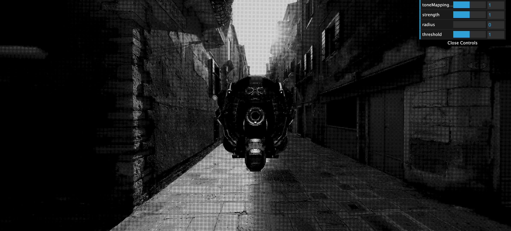
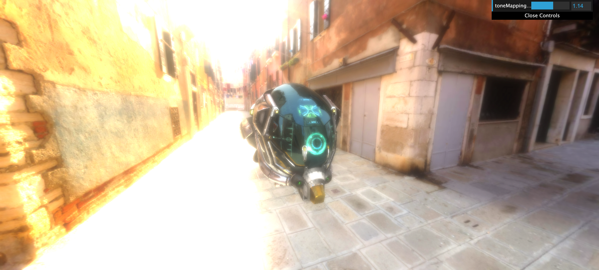

[效果合成器（EffectComposer）](https://threejs.org/docs/?q=effec#examples/zh/postprocessing/EffectComposer)

用于在three.js中实现后期处理效果。该类管理了产生最终视觉效果的后期处理过程链。 
后期处理过程根据它们添加/插入的顺序来执行，最后一个过程会被自动渲染到屏幕上。

new DotScreenPass()

new GlitchPass

unrealBloomPass

SMAAPass 抗锯齿效果

合成效果越多可能造成性能变差

| File   | Target                                      |
| ------ | ------------------------------------------- |
| src/main/main | 着色器实现自定义合成效果和水底波浪  |
| src/main/main01 | 效果合成和后期处理  |