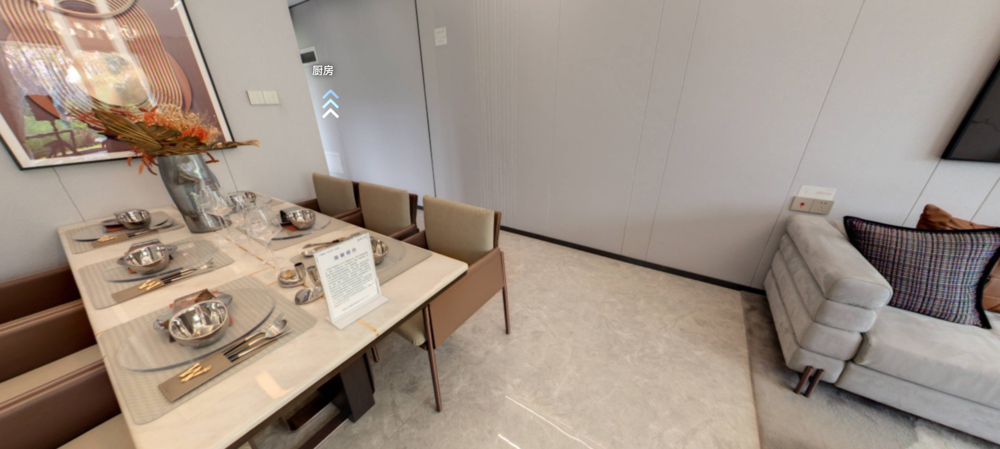

# VR 360 看房

其实就是给立方体贴上6个面，我们身处在中央就能实现这样的效果



## Project setup
```
yarn install
```

### Compiles and hot-reloads for development
```
yarn serve
```

### Compiles and minifies for production
```
yarn build
```

### Customize configuration
See [Configuration Reference](https://cli.vuejs.org/config/).
