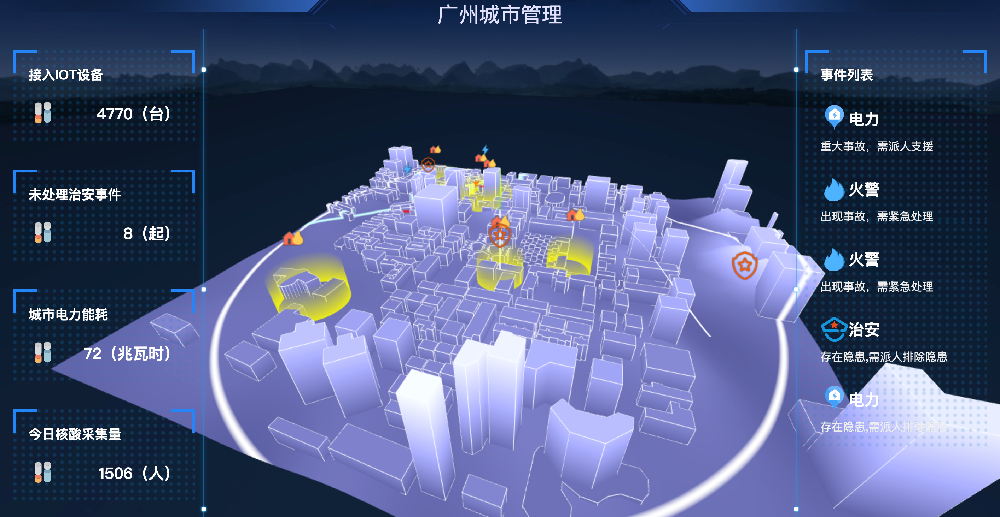

# threeapp 智慧城市



建筑线框实现
[边缘几何体（EdgesGeometry）](https://threejs.org/docs/index.html?q=Edg#api/zh/geometries/EdgesGeometry)
这可以作为一个辅助对象来查看geometry的边缘。

[线段（LineSegments)](https://threejs.org/docs/index.html?q=lines#api/zh/objects/LineSegments)
在若干对的顶点之间绘制的一系列的线。


光墙实现
[圆柱缓冲几何体（CylinderGeometry）](https://threejs.org/docs/index.html?q=CylinderGeometry#api/zh/geometries/CylinderGeometry)


## mock api
使用api fox将智慧城市接口mock.apifox.json导入

## Project setup
```
yarn install
```

### Compiles and hot-reloads for development
```
yarn serve
```

### Compiles and minifies for production
```
yarn build
```

### Customize configuration
See [Configuration Reference](https://cli.vuejs.org/config/).
