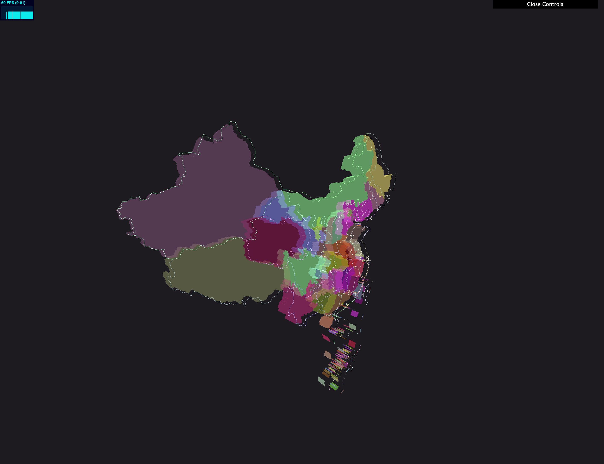

## GEOJSON 地理数据生成3D物体与地图




## GeoJSON是什么

如果你接触过数据可视化，那么大概率会知道GeoJSON。不知道？没关系，本文将为您娓娓道来！

GeoJSON是一种对各种地理数据结构进行编码的格式，基于Javascript对象表示法的地理空间信息数据交换格式。

官网： [https://geojson.org/](https://link.segmentfault.com/?enc=fZ5DBjLBq7BslwAhGLSQLQ%3D%3D.503MDqgCMgshXEWEtZI6doanvJiMjzsGHQrMgqwC2jE%3D)

中文翻译： [https://www.oschina.net/trans...](https://link.segmentfault.com/?enc=WgOulXbshCddv7VLJFoU8A%3D%3D.uZYw0WrtQIUAQE3Ijq7DX54MeOAJl%2B%2FswpBpxoNd04sAvRV02dzOl6VJqve%2BkHkl)

## GeoJSON对象

GeoJSON对象必须由一个名字为"type"的成员。

type成员的值必须是下面之一："Point", "MultiPoint", "LineString", "MultiLineString", "Polygon", "MultiPolygon", "GeometryCollection", "Feature", 或者 "FeatureCollection"。

GeoJSON对象分为三种：几何对象、特征对象、特征集合对象

**note:** 下面的代码都可以在 [http://geojson.io](https://link.segmentfault.com/?enc=55v3pXNWIYxAgd0gcBdw%2BA%3D%3D.bD3yx%2FBzztB1vGyrveTsitTCgPWTQWdrtLTfIu%2BdGvE%3D) 查看效果，如下：


### 几何对象

GeoJSON支持以下几何类型：Point，MultiPoint，LineString，MultiLineString，Polygon，和MultiPolygon。

除了“GeometryCollection”外的其他任何类型的GeoJSON几何对象必须由一个名字为"coordinates"的成员。coordinates成员的值总是数组。这个数组里的元素的结构由几何类型来确定。

#### 点（Point）

```json
{ "type": "Point", "coordinates": [100.0, 0.0] }
```

#### 多点（MultiPoint）

```prolog
{
    "type": "MultiPoint",
    "coordinates": [
        [ 100, 0 ],
        [ 101, 1 ]
    ]
}
```

#### 线 （LineString）

```prolog
{
    "type": "LineString",
    "coordinates": [
        [ 100, 0 ],
        [ 101, 1 ]
    ]
}
```

#### 多线 （MultiLineString）

```prolog
{
    "type": "MultiLineString",
    "coordinates": [
        [ [100.0, 0.0], [101.0, 1.0] ],
        [ [102.0, 2.0], [103.0, 3.0] ]
    ]
}
```

#### 多边 （Polygon）

没有孔的：

```prolog
{
    "type": "Polygon",
    "coordinates": [
        [
            [ 100, 0 ],
            [ 101, 0 ],
            [ 101, 1 ],
            [ 100, 1 ],
            [ 100, 0 ]
        ]
    ]
}
```

有孔的：

```prolog
{
    "type": "Polygon",
    "coordinates": [
        [
            [ 100, 0 ],
            [ 101, 0 ],
            [ 101, 1 ],
            [ 100, 1 ],
            [ 100, 0 ]
        ],
        [
            [ 100.2, 0.2 ],
            [ 100.8, 0.2 ],
            [ 100.8, 0.8 ],
            [ 100.2, 0.8 ],
            [ 100.2, 0.2 ]
        ]
    ]
}
```

#### 多多边（和MultiPolygon）

```prolog
{
  "type": "MultiPolygon",
  "coordinates":
    [ 
        [[[102.0, 2.0], [103.0, 2.0], [103.0, 3.0], [102.0, 3.0], [102.0, 2.0]]],
        [
            [
                [100.0, 0.0], [101.0, 0.0], [101.0, 1.0], [100.0, 1.0], [100.0, 0.0]
            ],
            [
                [100.2, 0.2], [100.8, 0.2], [100.8, 0.8], [100.2, 0.8], [100.2, 0.2]
            ]
        ]
    ]
}
```

#### 几何集合

```prolog
{ "type": "GeometryCollection",
  "geometries": [
    { "type": "Point",
      "coordinates": [100.0, 0.0]
      },
    { "type": "LineString",
      "coordinates": [ [101.0, 0.0], [102.0, 1.0] ]
      }
  ]
}
```

### 特征对象

类型为"Feature"的GeoJSON对象是特征对象。

特征对象必须由一个名字为"geometry"的成员，这个几何成员的值是上面定义的几何对象或者JSON的null值。

特征对戏那个必须有一个名字为“properties"的成员，这个属性成员的值是一个对象（任何JSON对象或者JSON的null值）。

如果特征是常用的标识符，那么这个标识符应当包含名字为“id”的特征对象成员。

```json
{
    "type":"Feature",
    "properties":{},
    "geometry":{ "type": "Point", "coordinates": [100.0, 0.0] }
}
```

### 特征集合对象

特征集合对象type为FeatureCollection。

类型为"FeatureCollection"的对象必须由一个名字为"features"的成员。与“features"相对应的值是一个数组。这个数组中的每个元素都是上面定义的特征对象。

```prolog
{
  "type": "FeatureCollection",
  "features": []
}
```

## 坐标参考系统对象

GeoJSON对象的坐标参考系统（CRS）是由它的"crs"成员（指的是下面的CRS对象）来确定的。如果对象没有crs成员，那么它的父对象或者祖父对象的crs成员可能被获取作为它的crs。如果这样还没有获得crs成员，那么默认的CRS将应用到GeoJSON对象。

## 边界框

GeoJSON对象可能有一个名字为"bbox的成员。bbox成员的值必须是2*n数组，这儿n是所包含几何对象的维数，并且所有坐标轴的最低值后面跟着最高者值。